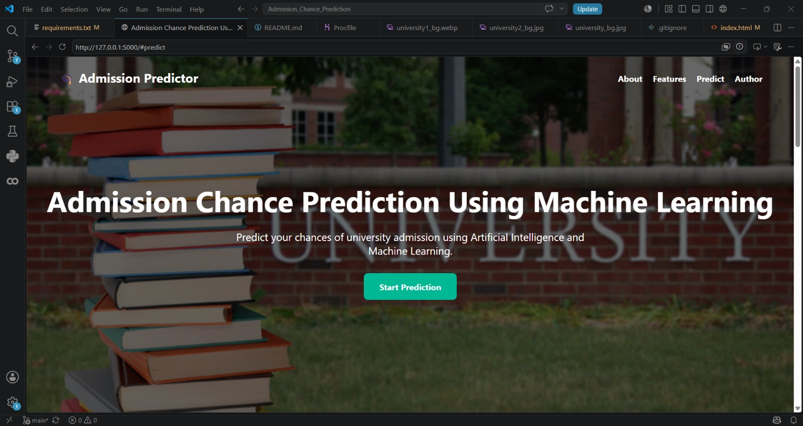
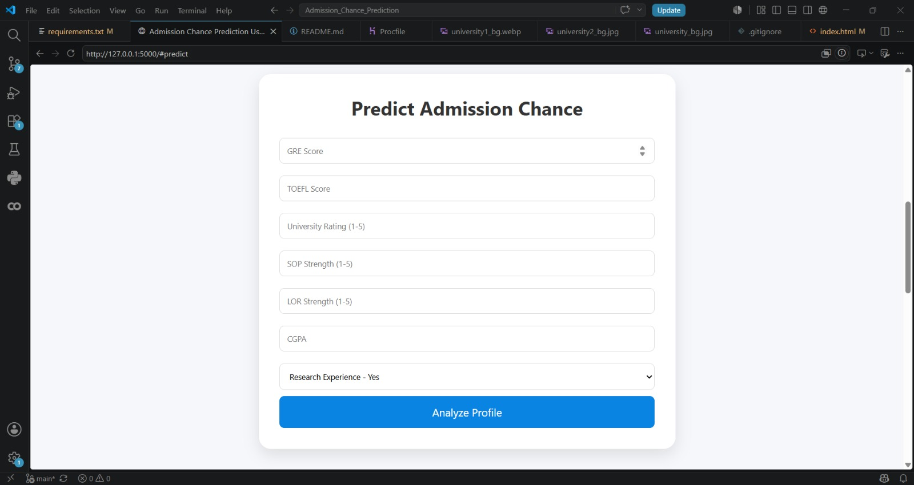
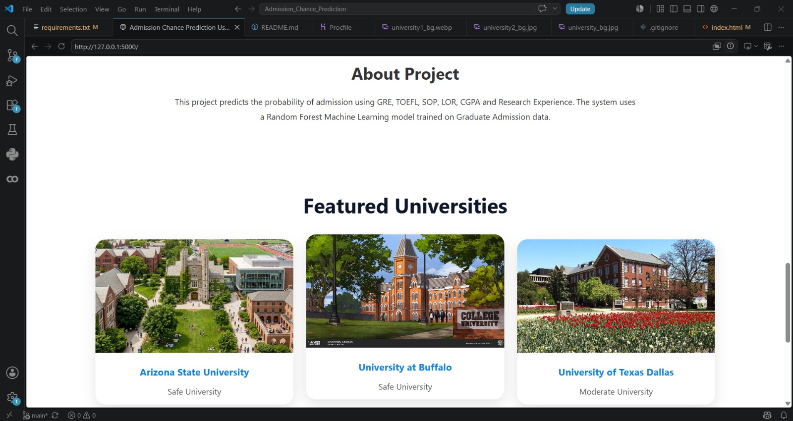
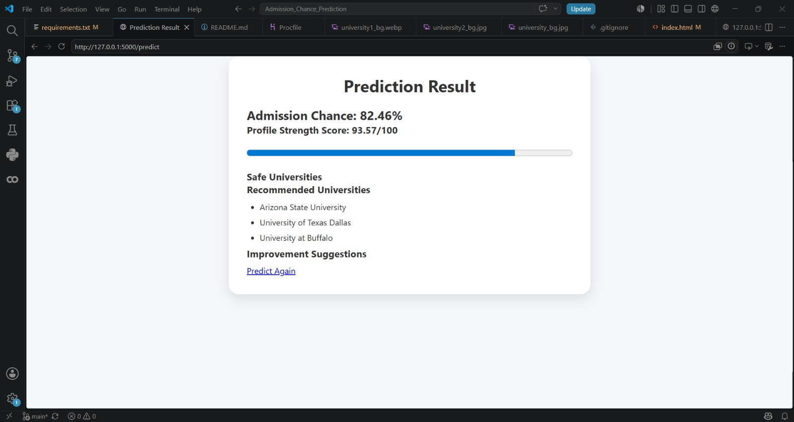

# 🎓 Admission Chance Prediction Using Machine Learning

## 📌 Project Overview

Admission Chance Prediction is a Machine Learning-based web application that predicts a student's probability of admission to graduate universities based on their academic profile.

The system analyzes factors such as GRE Score, TOEFL Score, CGPA, SOP, LOR, University Rating, and Research Experience to estimate admission chances and provide university recommendations.

---

## 🚀 Features

✅ Predict admission probability using Machine Learning

✅ Profile Strength Score Calculation

✅ University Recommendations

✅ Improvement Suggestions

✅ Interactive Web Interface

✅ Responsive Design

✅ Real-time Prediction Results

✅ Flask-Based Deployment

---

## 🛠️ Technologies Used

### Frontend

* HTML5
* CSS3
* JavaScript

### Backend

* Python
* Flask

### Machine Learning

* Scikit-Learn
* Random Forest Regressor
* NumPy
* Pandas
* Joblib

---

## 📊 Dataset Information

**Dataset Name:** Graduate Admissions Dataset

**Source:** Kaggle

**Features Used:**

* GRE Score
* TOEFL Score
* University Rating
* Statement of Purpose (SOP)
* Letter of Recommendation (LOR)
* CGPA
* Research Experience

**Target Variable:**

* Chance of Admit

---

## 🔄 Project Workflow

1. Data Collection
2. Data Preprocessing
3. Model Training
4. Model Evaluation
5. Flask Application Development
6. User Input Collection
7. Admission Prediction
8. University Recommendation Generation

---

## 🧠 Machine Learning Model

### Random Forest Regressor

The Random Forest Regressor was selected because:

* Handles nonlinear relationships effectively
* Produces stable predictions
* Reduces overfitting
* Performs well on admission datasets

---

## 📸 Project Screenshots

### Home Page



### Prediction Form



### Featured Universities



### Result Page



---

## 📁 Project Structure

```text
Admission_Chance_Prediction
│
├── dataset
│   └── Admission_Predict.csv
│
├── model
│   └── admission_model.pkl
│
├── screenshots
│   ├── home_page.jpeg
│   ├── prediction_form.jpeg
│   ├── featured_universities.jpeg
│   └── result_page.jpeg
│
├── static
│   ├── css
│   │   └── style.css
│   │
│   ├── images
│   └── js
│
├── templates
│   ├── index.html
│   └── result.html
│
├── app.py
├── train_model.py
├── requirements.txt
├── Procfile
└── README.md
```

---

## ⚙️ Installation

### Clone Repository

```bash
git clone https://github.com/aparnatalari/Admission_Chance_Prediction.git
```

### Move to Project Folder

```bash
cd Admission_Chance_Prediction
```

### Install Dependencies

```bash
pip install -r requirements.txt
```

### Run Application

```bash
python app.py
```

### Open Browser

```text
http://127.0.0.1:5000
```

---

## 📈 Sample Output

The system provides:

* Admission Probability (%)
* Profile Strength Score
* University Category
* Recommended Universities
* Improvement Suggestions

---

## 🔮 Future Enhancements

* University Ranking Integration
* Scholarship Prediction
* AI Chat Assistant
* Student Profile Dashboard
* Advanced Analytics
* Cloud Deployment

---

## 👩‍💻 Developed By

### Aparna Talari

B.Tech CSE

Aditya College of Engineering, Madanapalle

Admission Chance Prediction Using Machine Learning

Python | Flask | Scikit-Learn | Machine Learning

© 2026 All Rights Reserved

---

## ⭐ Support

If you found this project useful, consider giving it a star on GitHub.
